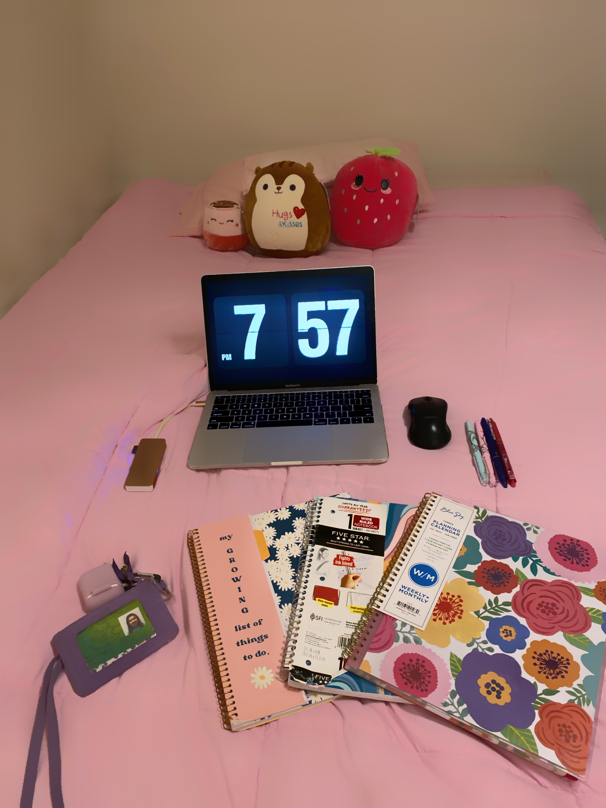

# My First Coding Assignment

## About Me

My name is Rachel Folse. I am from Baton Rouge, LA. I got my undergraduate degree in Strategic Communications from Southeastern Louisiana University. In my free time, I like to exercise, watch television, listen to music, and read.

## Past Coding Experience

I've done HTML and CSS in two web design courses I have taken through high school and college . I have also learned a little bit about Javascript and the terminal, but I am not as proficient in these as I would like to be so I hope to master these skills by the end of this course.

## Career Goals

1. Receiving my Master's Degree in Web Design
2. Getting experience in the technology field through my first full time position
3. Continuous learning through online certifications
